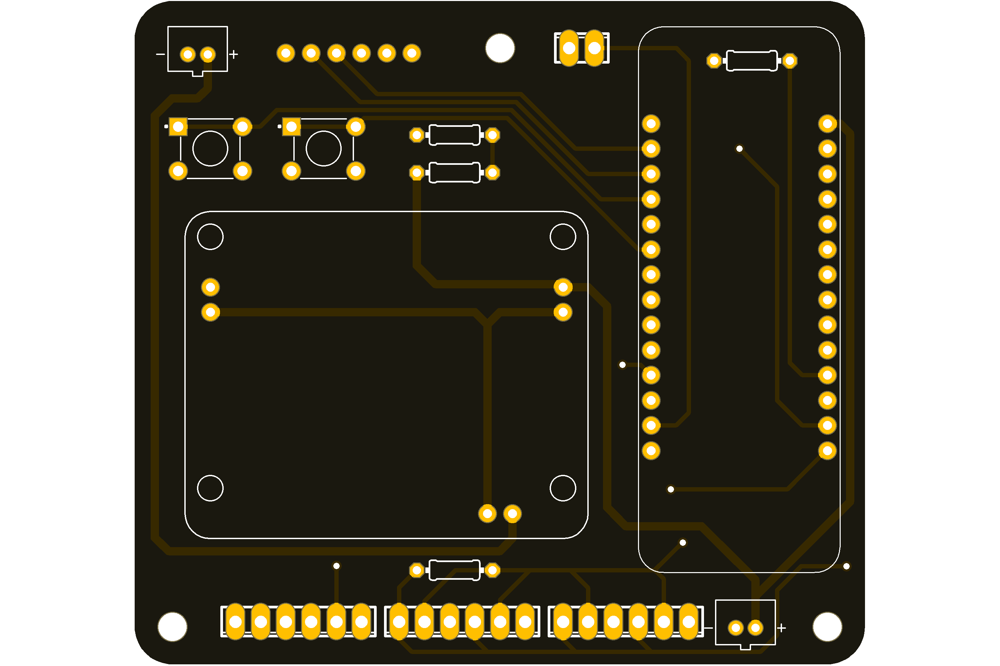

# Road surface temperature logger

The road surface temperature logger has been designed as a low-cost unit to support various road surfacing trials. The logger utilises a Pycom microcontroller with screw terminals for upto four DS18B20 temperature probes. Inputs are also provided for a rain gauge, anemometer and light sensor, if needed.

The Pycom microcontroller provides for easier development of the onboard software (in Python), along with built-in cellular and/or LoRa connectivity. 

## Parts list

### Custom parts (see sections below)

- PCB
- Enclosure mount

### PCB components
- [Pycom FiPy](https://pycom.io/product/fipy/) or [LoPy4](https://pycom.io/product/lopy4) (no cellular)
- [Lithium battery solar charge controller](https://www.adafruit.com/product/390)
- 2x [JST-PH socket](https://nz.rs-online.com/web/p/products/8201422/)
- 2x [Tactile switch](https://nz.rs-online.com/web/p/products/4791413/)
- 2x [100k Ohm resistor](https://nz.rs-online.com/web/p/through-hole-fixed-resistors/7550704/)
- 1x [4.7k Ohm resistor](https://nz.rs-online.com/web/p/through-hole-fixed-resistors/7077726/)
- 1x [220 Ohm resistor](https://nz.rs-online.com/web/p/through-hole-fixed-resistors/7077612/)
- 2x [14-way PCB socket (single row, 2.54mm)](https://nz.rs-online.com/web/p/products/1981500/)
- 1x [6-way PCB socket (single row, 2.54mm)](https://nz.rs-online.com/web/p/pcb-sockets/1981494)
- 3x [2-way PCB header (single row, 2.54mm)](https://nz.rs-online.com/web/p/pcb-headers/1802111/)
- 3x [6-way terminal block (2.54mm)](https://nz.rs-online.com/web/p/products/1918717/)
- 1x [2-way terminal block (2.54mm)](https://nz.rs-online.com/web/p/pcb-terminal-blocks/1919055/)

### Logger hardware
- [Enclosure with polycarbonate cover](https://www.digikey.co.nz/product-detail/en/bud-industries/PN-1325-CMB/377-1894-ND/2674158)
- [2.5W solar panel](https://www.seeedstudio.com/2-5W-Solar-Panel-116X160.html)
- 3.7V lithium battery (~13.8 Ah with built-in protection)
- [DS18B20 temperature probes](https://nz.rs-online.com/web/p/temperature-humidity-sensor-ics/1901709/)
- 3-core sensor wire (temperature probe extension)
- [6.4mm heat shrink](https://nz.rs-online.com/web/p/heat-shrink-cold-shrink-sleeves/0397821) (temperature probe encapsulation)
- [*DAVIS rain collector #6466M*](https://scientificsales.co.nz/davis-6466m-aerocone-rain-collector-pole-mount-0.2mm/) (optional)
- [*DAVIS anemometer #6410*](https://scientificsales.co.nz/davis-6410-anemometer-for-vantage-pro/) (optional)

### Programming hardware
- [PyCom Expansion board](https://pycom.io/product/expansion-board-3-0/) OR
- [Serial programmer](https://nz.rs-online.com/web/p/communication-wireless-development-tools/1346453/)

### Mounting system
- Pole and socket
- U-bolts

## PCB

The printed circuit board manufacturing files can be found in [assembley_files.zip](assembly_files.zip). There are a number of low-cost options available for getting these manufactured.

## Enclosure mount

The enclosure mounting plate is designed for the enclosure, solar panel and PCB listed in the parts section above. It should be 3D printed out of ABS plastic.

## Licence

MIT
